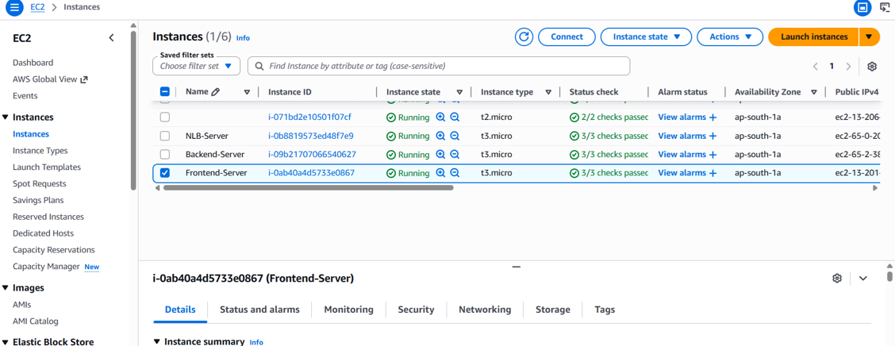

# Multi-tier Web App Deployment

## 🎯 Purpose

The purpose of this project is to deploy a scalable and secure multi-tier web application architecture on AWS by separating the application into different layers:

* **Frontend Tier** – Handles user interface and client-side requests.
* **Backend Tier** – Processes application logic and server-side operations.
* **Database Tier** – Stores and manages application data securely.

This architecture improves scalability, security, maintainability, and performance by isolating each layer of the infrastructure.

## 🧰 AWS Services Used

* **Amazon EC2** – Used for hosting frontend and backend application servers.
* **Amazon RDS** – Used for managed relational database services.
* **Elastic Load Balancer (ELB)** – Used for distributing incoming traffic across multiple servers.

## Project Screenshots

### 1. GitHub Project Files
[View GitHub Files](./github%20files.txt)

### 2. EC2 Instances

### 3. RDS Database

### 4. Database Created for Backend Server

### 5. Backend Command Execution

### 6. Backend Server Open in Browser
.png)

### 7. Load Balancer

### 8. Target Group

### 9. Frontend Server Open in Browser
.png)

### 10. Frontend Calling Backend

